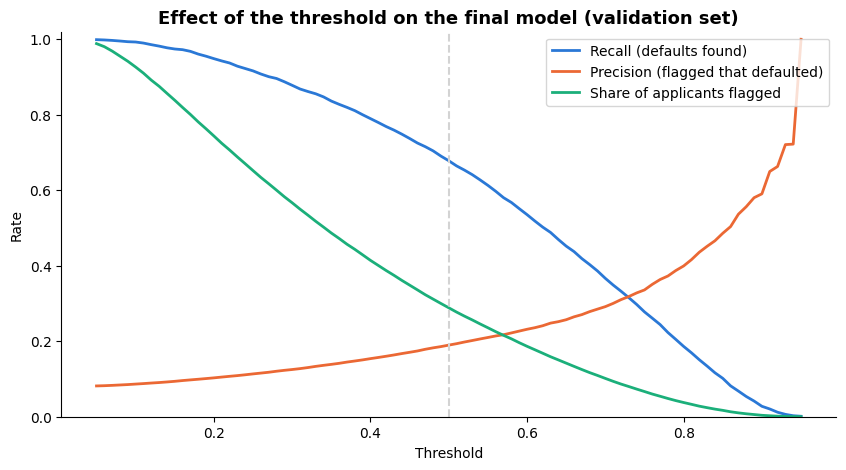
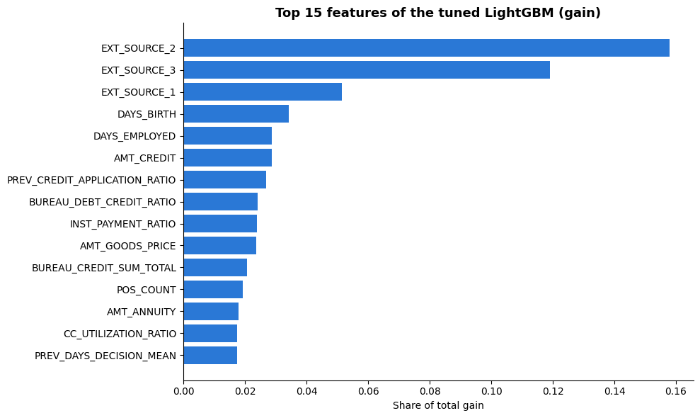
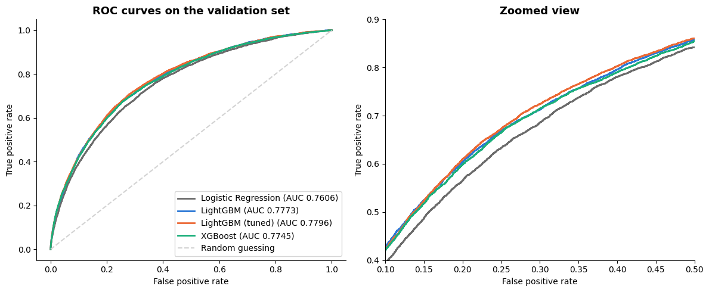
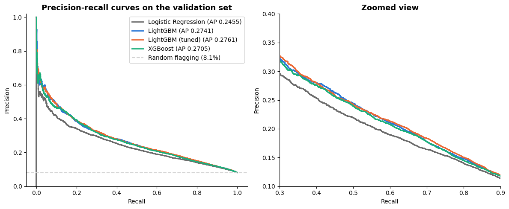

# Home Credit Default Risk: From Loan Data to Lending Decisions

Banks lose money in two ways: by lending to applicants who don't repay, and by turning away good customers. This project builds a model that predicts payment difficulties for 307,511 loan applicants from the [Home Credit Default Risk](https://www.kaggle.com/c/home-credit-default-risk) dataset (Kaggle), and goes one step further: it shows what the model's predictions mean for real approve-or-reject decisions and checks whether it treats groups of applicants differently.

The project covers the full workflow: exploratory analysis, feature engineering with five linked tables, model comparison, threshold analysis, feature importance and a fairness check.

## Highlights

- **Careful data exploration:** the EDA showed that three seemingly unrelated columns (`DAYS_EMPLOYED` with the placeholder 365243, a missing `OCCUPATION_TYPE`, and `ORGANIZATION_TYPE` = "XNA") all mark the same 55,374 applicants, almost all of them pensioners. Instead of dropping the placeholder, I replaced it and kept the information as a separate flag (`DAYS_EMPLOYED_ANOM`). Other findings, such as an implausible income of 117 million and 41 columns with 50-70% missing values, were also checked and handled explicitly.
- **Risk patterns found before any modeling:** the default rate falls from 18.3% to 3.0% across the deciles of the external score `EXT_SOURCE_2`, and differs strongly by occupation (17.1% for low-skill laborers, 4.8% for accountants). The three external scores were the strongest signals in the EDA, and the final model confirms this: they are its top three features.
- **A model that ranks risk well:** the tuned LightGBM reaches a validation AUC-ROC of **0.7796**, compared to 0.7606 for a Logistic Regression baseline. Only 8.07% of applicants default, so accuracy would be misleading and the models are compared by AUC-ROC and precision-recall.
- **From a score to a decision:** at a threshold of 0.5, the model finds **67.8% of all defaults** while flagging 28.9% of applicants. The project shows how this trade-off changes with the threshold and how a bank's cost ratio (missed default versus rejected good applicant) would determine the right setting.
- **Self-engineered features that the model relies on:** all four ratio features I built from the linked tables end up among the model's top 15 features, three of them in the top 10, ahead of raw columns such as `AMT_GOODS_PRICE` and `AMT_ANNUITY`.
- **Honest evaluation:** three gradient boosting models (LightGBM, tuned LightGBM, XGBoost) perform practically the same, and the hyperparameter search brought no meaningful gain.
- **Fairness check:** at the same threshold, male applicants are flagged more often (38.4% vs. 23.9%) and good male applicants are rejected more often (false positive rate 34.2% vs. 21.1%), partly because their actual default rate is higher. The project documents the trade-offs between fairness criteria instead of hiding them.

## Selected results

**How the threshold changes the decision** (validation set, final model):

**What the model relies on** (top 15 features by gain):

**Comparison of the models** (ROC curves, full and zoomed view):

**Precision and recall per model** (precision-recall curves, important because only 8.07% of applicants default):

## Custom features: turning raw tables into risk signals

The linked tables contain millions of rows of credit history. To make them usable, I aggregated each table to one row per applicant and built four ratio features from domain knowledge. Each is a sum divided by a sum at the applicant level (so a single unusual record cannot dominate), with explicit handling of zero denominators.

| Feature | Definition | Idea | Rank in feature importance | Share of gain |
|---|---|---|---|---|
| `PREV_CREDIT_APPLICATION_RATIO` | granted credit ÷ requested amount across previous applications | Has Home Credit repeatedly granted less than the applicant asked for? | 7 | 2.70% |
| `BUREAU_DEBT_CREDIT_RATIO` | current debt ÷ total credit sum at other lenders | How much of the available credit is already drawn down (credit utilization)? | 8 | 2.40% |
| `INST_PAYMENT_RATIO` | amount paid ÷ amount due across past installments | Does the applicant pay what is due? | 9 | 2.38% |
| `CC_UTILIZATION_RATIO` | credit card balance ÷ credit limit | How heavily is the card limit used? | 14 | 1.75% |

## Notebooks

| Notebook | Content |
|---|---|
| [`notebooks/01_eda.ipynb`](notebooks/01_eda.ipynb) | Exploratory analysis of `application_train.csv`: data quality, target distribution, missing values (including the block of building features and the recurring "not currently employed" group), numerical and categorical features, correlations with the target |
| [`notebooks/02_feature_engineering.ipynb`](notebooks/02_feature_engineering.ipynb) | Data cleaning (placeholder values, income outlier), categorical encoding, handling of missing values, removal of redundant building features, and aggregated features from five linked tables (`bureau`, `previous_application`, `POS_CASH_balance`, `credit_card_balance`, `installments_payments`), including four custom ratio features. `bureau_balance` was left out on purpose. Result: 244 columns without missing values |
| [`notebooks/03_modeling.ipynb`](notebooks/03_modeling.ipynb) | Stratified train/validation split, Logistic Regression baseline, LightGBM (with hyperparameter search) and XGBoost, ROC and precision-recall curves, confusion matrix and threshold analysis, feature importance, fairness check across gender groups |

## Limitations and outlook

Knowing the limits of an analysis is part of the work, so they are documented here:

- **Preprocessing and data leakage:** some preprocessing statistics (imputation medians, income cap, one-hot categories) were computed on the full training data before the train/validation split. This lets a small amount of validation information into the preprocessing; the scaling for the Logistic Regression was fitted on the training part only. A next version would wrap all preprocessing in a pipeline that is fitted after the split.
- **Evaluation:** all results come from a single validation split of the Kaggle training data. The models were not scored on the hidden Kaggle test set.
- **Threshold analysis:** the cost ratios used to illustrate threshold choices are assumptions, not values from the data.
- **Gender in the data:** the column `CODE_GENDER` contains only the values "M" and "F" (plus four rows with an unknown value, which were treated as missing). Other gender categories were not recorded, so the fairness check can only compare these two groups and says nothing about other gender identities.
- **Feature importance:** importance shows how much the final model uses a feature, not that it causes default. I did not train a model without the custom features, so I cannot say how much AUC they add on their own.
- **Outlook:** features from `bureau_balance`, a wider hyperparameter search (two of the best values lay at the edge of the search range) and tuning of XGBoost.

## Skills demonstrated

Data cleaning and quality checks, feature engineering across relational tables (joins, aggregation), handling class imbalance, gradient boosting (LightGBM, XGBoost), cross-validated hyperparameter search, model evaluation beyond a single metric (ROC, precision-recall, confusion matrix), translating model output into business decisions, model interpretation and fairness analysis, clear documentation of results and limitations.

**Tech stack:** Python, pandas, NumPy, scikit-learn, LightGBM, XGBoost, matplotlib, seaborn, Git/GitHub. The notebooks were run on Kaggle.

## Data

The data is not included in this repository. It can be downloaded from the [competition page](https://www.kaggle.com/c/home-credit-default-risk/data).
